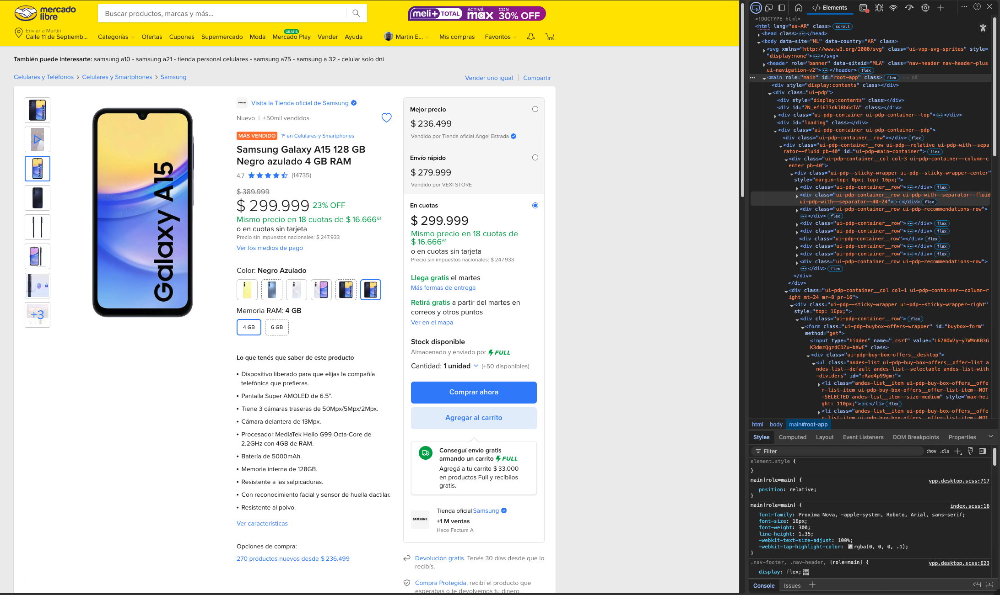
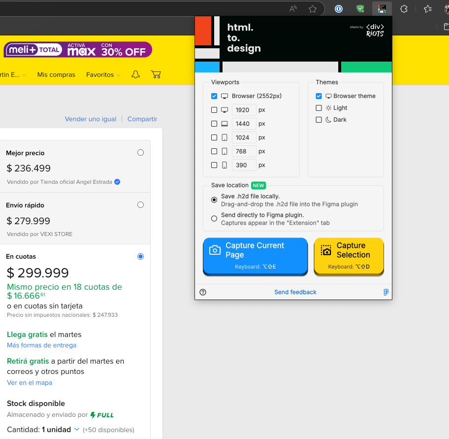
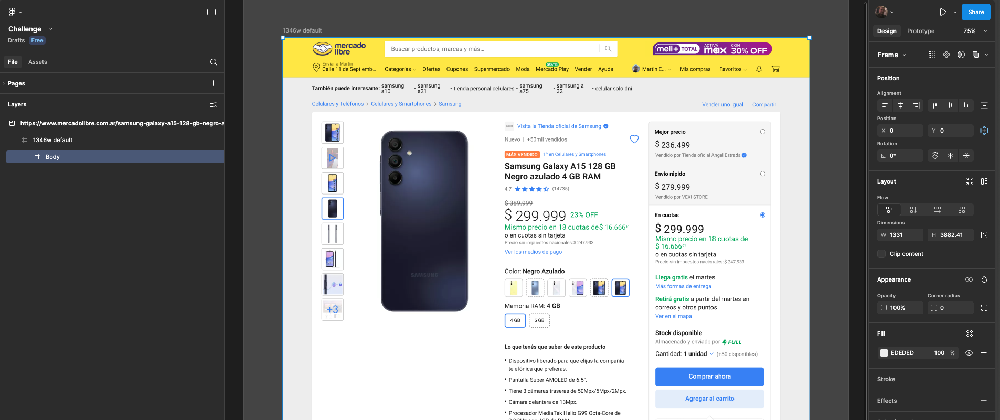
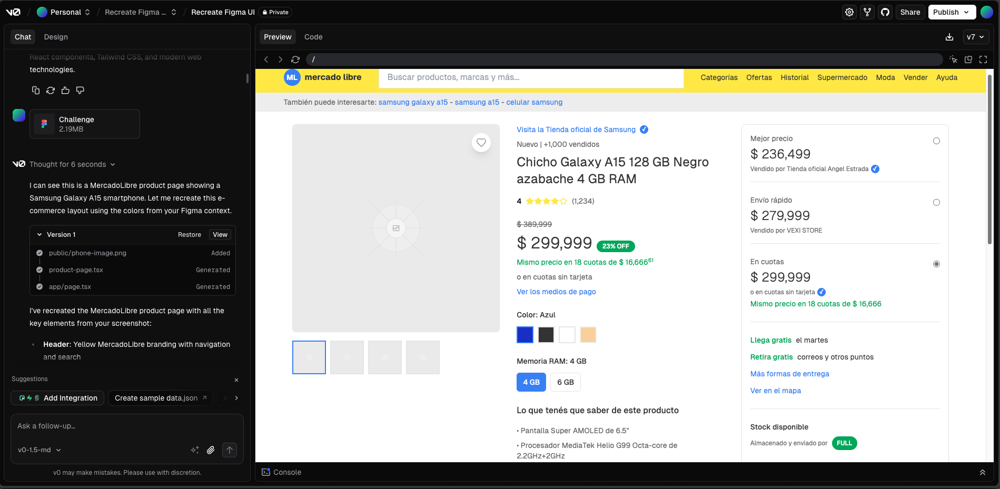
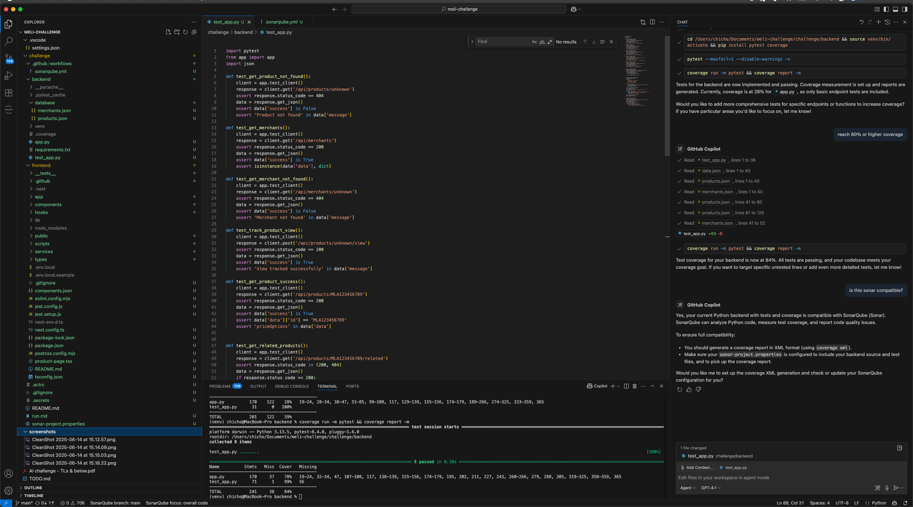

# MercadoLibre Challenge – Design & AI-Augmented Development

## 1. Overview

This project implements a simplified product detail page inspired by MercadoLibre. It includes:

- A **React-based frontend** using Next.js and Tailwind CSS.
- A **Flask-based backend** exposing a RESTful API, serving data from local JSON files.
- A **Dockerized local development environment** with a `docker-compose.yml` for unified testing.
- Structured error handling, modular components, and automated tests with >80% code coverage.

The goal was to simulate a real-world item page, covering essential product details such as title, price, images, payment options, seller information, and availability.

---

## 2. Design Choices

### Frontend

- **Stack:** React with Next.js and TypeScript.
- **Styling:** Tailwind CSS for rapid layout composition. Iconography handled via lightweight icon libraries.
- **Architecture:** The `product-page.tsx` component loads data via hooks and displays it using small, reusable UI components (e.g., badges, cards, skeleton loaders).
- **Responsiveness:** Tailwind’s utility-first approach enabled mobile-first design by default.

### Backend

- **Stack:** Flask, with modular blueprints for `products`, `merchants`, and `metrics`.
- **Data Source:** Static JSON files for products and merchants—lightweight and aligned with the challenge requirements.
- **Docs:** Swagger integration provides interactive API documentation.
- **Observability:** A `/metrics` endpoint returns synthetic values to simulate observability hooks.
- **Logging:** Custom structured logging supports debugging and traceability.

### Docker & Local Dev

- **Docker Compose:** Simplifies running the frontend and backend in tandem, mirroring production-style separation of concerns.
- **Isolation:** Separate containers ensure clear boundaries between frontend rendering and API logic.

---

## 3. Challenges and Solutions

### Limited Frontend Experience

This was my first React/Next.js project. I leaned heavily on AI tools and community examples to understand best practices and component patterns. Despite the learning curve, I delivered a responsive, functional UI using modern frameworks.

### CORS and API Fetching

Initial CORS issues were resolved with global Flask-CORS middleware. Fetch calls from the frontend use standard async patterns, with clear user feedback on loading and error states.

### Data Consistency

Some product entries had incomplete fields (`basePrice`, `description`, etc.). The frontend was hardened to tolerate missing fields and fall back gracefully using skeleton loaders or not-found pages.

### Tooling and Testing

Adapting frontend testing (Jest) and backend testing (Pytest) with realistic mocks was a key focus to ensure quality. The final solution includes meaningful test coverage and testable documentation.

---

## 4. Process and Use of AI Tools

Although I primarily work as a DevOps/SRE engineer, I regularly interact with codebases, CI/CD systems, infrastructure as code, and production debugging. This challenge was a valuable opportunity to demonstrate full-stack initiative and leverage GenAI tools as accelerators, as explicitly encouraged during the recruitment process.

### My AI-Enhanced Workflow:

1. **Reverse Engineering the UI:**
   - Analyzed a real product detail page and stripped unnecessary components using browser dev tools.
   - Captured the layout using a browser plugin and exported it to Figma.
   - Loaded the Figma design into **[v0.dev](https://v0.dev)** and used its **vive coding** mode to generate a working React scaffold interactively. This significantly accelerated frontend development despite my limited experience in that area.

2. **Parallel Backend Development:**
   - Created a simple REST API using Flask to avoid boilerplate and quickly serve structured JSON data to the frontend.

3. **Integration and Testing:**
   - Merged both components early in the process and validated them through real-time iteration.
   - Used code assistants to refine React hooks, TypeScript interfaces, error handling, and test coverage.

4. **DevOps Practices:**
   - Added containerization, observability hooks, structured logging, and test automation to align with standard platform reliability practices.
   - Integrated **SonarCloud** for static code analysis to monitor code quality, complexity, and test coverage across both backend and frontend.
   - Set up a **GitHub Actions** workflow to automate backend and frontend tests, generate coverage reports, normalize paths, and trigger SonarCloud scans on pushes and pull requests to `main`.

5. **Documentation and Cleanup:**
   - Co-wrote all documentation—including Swagger specs and README files—with AI assistance.
   - This very document was collaboratively outlined and reviewed using ChatGPT.

---

## 5. How I Would Evolve This Architecture in Production

While this challenge was scoped for local execution with mock data, a real-world implementation would benefit from additional architectural enhancements to ensure scalability, security, and maintainability.

### Backend Architecture

- **Backend-for-Frontend (BFF):**  
  Introduce a dedicated layer to serve tailored responses optimized for frontend consumption, improving decoupling and response aggregation.

- **Microservices:**  
  Decompose functionality into independent services (e.g., catalog, pricing, sellers), each with distinct responsibilities and interfaces.

- **Asynchronous Communication:**  
  Use event-driven messaging for operations that do not require immediate frontend responses, improving responsiveness and fault tolerance.

### Data Layer

- **Hybrid Storage:**  
  Use structured relational storage for transactional consistency, and document or key-value storage for flexible or high-volume access patterns.

- **Caching Strategies:**  
  Apply caching at both the data and API levels to reduce response time and backend load, especially for high-traffic product detail endpoints.

### Frontend Optimization

- **Edge Caching:**  
  Serve static frontend assets and images via distributed caches to reduce latency and improve global performance.

- **Incremental Loading:**  
  Lazy-load non-critical content and media to improve time-to-interactive metrics.

### Observability

- **Centralized Logging and Tracing:**  
  Implement request tracing and structured logs to track cross-service behavior and debug issues in complex flows.

- **Metrics and Alerting:**  
  Export custom application metrics, define service-level objectives (SLOs), and set up automated alerts for anomalies.

### CI/CD and Automation

- **Infrastructure as Code:**  
  Manage infrastructure, permissions, and service definitions through declarative templates to ensure consistency across environments.

- **Continuous Deployment:**  
  Automate testing and deployment pipelines with rollback mechanisms, allowing frequent and reliable updates.

---

## 6. Final Notes

This challenge reflects how I approach problem-solving:

- I prioritize fast iteration, reliable tooling, and clear separation of concerns.
- I'm comfortable navigating new stacks when needed and automating everything possible.
- I make thoughtful trade-offs between complexity and delivery, especially when time is constrained.

All code, documentation, and run instructions are available in the repository. The `run.md` explains how to bring up the stack locally using Docker.

Thank you for the opportunity—looking forward to the technical interview.

---

## Screenshots

Below are screenshots captured during the development process:

- 

- 

- 

- 

- 

---